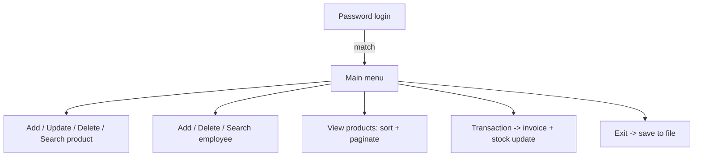

# Chill Market Shop Management System (C++)

> A console-based **inventory & employee management system** in C++, built on classic data structures: linked lists, a hash table, paginated records, and a trie.


Chill Market simulates the back-office of a retail store: staff log in with a password, then manage products and employees, browse stock page-by-page, sort by price, and run point-of-sale transactions that generate an invoice and persist stock back to disk.

---

## Features

- 🔐 **Password login** stored/looked-up via a hash table (open addressing)
- 📦 **Product management**: add, update, delete, search; with expiry and consumable flags
- 👨‍💼 **Employee management**: add, delete, search records
- 📄 **Paginated product view**: records grouped into pages you can step through
- ↕️ **Sorting**: list products by price (low→high, high→low, or insertion order)
- 🧾 **Transactions**: build a cart, decrement stock, print a customer invoice, total the bill
- 💾 **File persistence**: stock and employee records saved between sessions

---

## Data Structures Used

| Structure | Role in the app |
|-----------|-----------------|
| Singly linked list | Master list of products and of employees |
| Hash table (open addressing) | Login/password lookup |
| Paged record array | `ProductPagesNode` — pagination of the product catalogue |
| Trie | Prefix structure for product-name suggestions |

---

## Menu Flow



---

## Build & Run

> **Platform note:** this program uses Windows-only headers (`conio.h`, `Windows.h`) and `system("cls")`, so it targets **Windows**.

**With g++ (MinGW) on Windows:**
```bash
g++ Project.cpp -o ChillMarket.exe
ChillMarket.exe
```
Default login password: `12`

---

## Project Structure

```
Project.cpp   Entire application (records, data structures, menus, persistence)
LICENSE
```
Runtime data files (`StockRecord.txt`, `EmployeeRecord.txt`, `InvoiceFile.txt`) are created on first save.

---

## Notes & Possible Improvements

- **Windows-only** today; porting would mean replacing `conio.h`/`Windows.h`/`system("cls")` with portable equivalents.
- The **trie** is included but product search currently runs a linear scan — wiring search/auto-suggest through the trie is a natural next step.
- Records are persisted by writing the node structs (including their `next` pointers) directly to disk; a more robust format would serialise only the data fields.

---

## Author

**Muhammad Wajih Hyder** — BS Computer Science, FAST‑NUCES (2026)
[GitHub @wajihhyder](https://github.com/wajihhyder) · wajihhyder22@gmail.com
